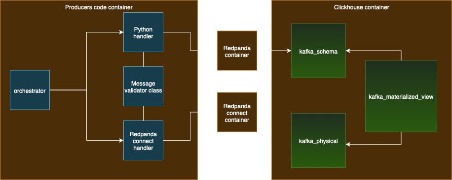

# Architecture Diagram

According to challenge, at least 2 containerized services were necesary:

- Redpanda
- Clickhouse

Regarding the producers code, I had 2 options:

- Redpanda connect
- Any other language of election (Python, Rust, Go)

In order to explore all posibilities, I decided to implement both strategies: Redpanda connect and language of election (Python)

I chose Python because this was my first time working with Binance data, websockets stream, publishing into Redpanda and also working with clickhouse, so I wanted a confortable starting point to connect all the dots. Now that solution is done, it should be relatively "easy" to port logic into Rust.

At least one spot-symbol was needed for the challenge. I decided to make it as flexible as possible, so I created a file called: `symbols.txt`. For each symbol defined in that file, a websocket will be created to handle corresponding stream data. I included 3 symbols for testing purposes.

Both producers (redpanda connect and python) are containerized as well, so in total we can have up to 4 containers:

- Redpanda
- Clickhouse
- Producers code (This container is created always, because it contains the logic to orchestrate between redpanda connect producer or python producer)
- Redpanda connect (This container is created only if redpanda connect producer is chosen as producer)

Overall architecture



 - Brown boxes are contaienrs
 - Blue boxes are python code
 - Green boxes are tables/views in clickhouse

 # Setup

 In order to run the solution, 3 things are needed:
  - Docker engine (mandatory)
  - Docker compose (mandatory)
  - make (optional but useful)

## Docker

https://docs.docker.com/engine/install/

https://docs.docker.com/compose/install/

## Make

Most of Linux distribution (and macOS) include make by default. If that's not the case, few options are:

Debian/Ubuntu: `sudo apt install build-essential`

CentOS/RHEL: `sudo yum install make or sudo dnf install make`

macOS: `xcode-select --install`

# Test the solution

Once Docker and Make are present in the system, it's necesary to open 2 terminals

## Terminal 1

In this terminal we will run pipeline either using `python producer` or `repanda connect producer`

### Python producer
```bash
make compose-producer-python
```

### Redpanda connect producer
```bash
make compose-producer-redpanda-connect
```

Once any of those 2 commands is running, all required services will start to setup and run

## Terminal 2

In order to validate info really is beign received by clickhouse, it's possible to run couple of queries.

It's good idea to run following commands as soon as the pipeline in Terminal 1 is running, that way it will be more evident how there was a moment with no data at all, and later how table are growing.

### Verify data exists
```bash
make query-verify-data-exists
```

### Verify materialized view:
```bash
make query-verify-materialized-view
```

### Verify that number of symbols matches with symbols defined in symbols.txt:
```bash
make query-count-trades_by-symbol
```


### Verify that there are no records with empty fields:
```bash
make query-no-empty-fields
```


### Verify that there are no duplicated records:
```bash
make query-for-duplicates
```

### Enter to clickhouse container for queyrin
It is also possible to inter into clickhouse and write custom sqls using:
```bash
make enter-clickhouse-container-for-querying
```

To exit from clickhouse:
```bash
exit
```

Once all verifications are done, is it possible to go back to terminal 1 and press `Cntl+C` to stop all containers

# Data quality and testing
There is a python class to validate that there are no duplicated messages and there are no nulls in the fields sent to Redpanda.

It's also possible to run correspoinging unit test focused on those validations:
- test_valid_message
- test_missing_field
- test_missing_value
- test_duplicated_trade_id
- test_invalid_json
```bash
make unit-test
```

# ClickHouse Materialized Views
I didn't followed standard nomenclature for MergeTree tables because it was a litte bit confusing what was the responsability of each table object, so I used following logic:

- ENGINE = KAFKA -> Schema
- ENGINE = MergeTree -> Physical

After that It was easier to understand that Marerialized View is kind of a trigger "listening" KAFKA ENGINE tables to move that data into MergeTree ENGINE tables.

Now the difference is clear, however I'll let not-standard names for future reference if needed.

# End to end explanation
The complete flows changes a little bit depending on the producer (python or redpanda connect).

## Pipeline using python producer
1. producers_orchestrator.py is called with default command (python producer)
2. The list of symbols is read from symbols.txt
3. A websocket is created for each symbol (all symbols are running in parallel)
4. Every message is validated
5. Valid messages are sent to Redpanda topic `borderless_challenge` using `confluent_kafka.Producer`. 
6. Redpanda listens on port `9092`
7. clickhouse schema table (engine kafka) is "suscribed" to the same topic and port
8. clickhouse materialized view is moving data from schema (engine kafka) into physical table (engine MergeTree)

## Pipeline using redpanda connect
1. producers_orchestrator.py is called including `--redpanda-connect` flag
2. The list of symbols is read from symbols.txt
3. A websocket is created for each symbol (all symbols are running in parallel)
4. Every message is validated
5. Valid messages are sent using POST request to `redpanda_connect` server on port `8080`. 
6. Redpanda connect receives POST messages and send them to Redpanda topic `borderless_challenge`
7. Redpanda listens on port `9092`
8. clickhouse schema table (engine kafka) is "suscribed" to the same topic and port
9. clickhouse materialized view is moving data from schema (engine kafka) into physical table (engine MergeTree)

## Key difference between python producer and redpandas producer
1. For python producers we need to specify a callback function to handle Redpanda responses. Probably we want to trigger an alert if we detect that Respandas is not available. Also the `confluent_kafka.Producer` is not sending messages inmediately, instead is storing messages in internal buffer and sends data in batches, when buffer is full or when clients does it "manually".
In this approach message sending is totally controled by the code. This is great option if we want to implement extra actions based on Redpanda topic response. The trade-off here is that since we're storing messages in buffer, we need to take that in consideration for high-traffic applications. 

2. For redpanda producers we don't need to specify any callback, we just send POST request into redpanda_connect server. redpanda_connect server is listening requests and forwardthem into Redpanda topic.
In this approach message sending is splited into 2 components: light python client and redpandas connect. In this approach we lose control over the Redpanda topic responses, however this is good if we don't need to implement extra actions based on Redpanda topic response and we have high-traffic application.

## Redpanda topic
At the beggingin of the challenge I considered to have a topic by symbol. However in the middle of the challenge I realized that probably that approach was't the best option, because that implies to have multiple redpanda connect services (one by symbol) and also multiple kafka schema tables, and probably that was out of the scope of the challenge.